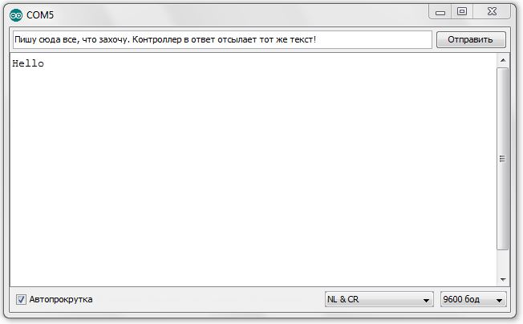

В ходе данной работы ты научишься передавать сигналы с компьютера на робота и
наоборот через проводной последовательный порт.<!--more-->

Это может потребоваться при управлении роботом с помощью клавиатуры, мыши или смартфона.

TIP: *Последовательный порт (COM-порт, Serial Port*)
 – это стандартный двунаправленный последовательный порт компьютера,
 используется для передачи данных согласно *протоколу RS-232* и не только.

TIP: *Протокол передачи данных* — стандарт, описывающий правила взаимодействия
функциональных блоков при передаче данных.

То есть протокол - набор правил, по которым будут общаться устройства.

NOTE: *RS-232 (Recommended Standard 232)* – это протокол
последовательной передачи данных между двумя устройствами
(информация передается пакетами по одному байту). Согласно данному протоколу,
информация передается у виде двоичного кода: логическому нулю соответствует
значение напряжение со знаком “+”, а логической единице соответствует
значение напряжения со знаком “–“.

=== Ход работы
1. Установи Arduino Nano на кросс-плату.
+
.Установка Nano в кросс-плату

2. Подключи устройство к компьютеру через последовательный порт и загрузи на него код.
Поскольку общение будет происходить через порт, важно *не отсоединять* провод от платы.
+
....
// Общение с компьютером через последовательный порт

void setup()
{
  // Определяем последовательный порт
  // Задаем скорость передачи данных 9600 бод
  Serial.begin(9600);

  // Отправляем по последовательному порту
  // сообщение "Hello"
  Serial.println("Hello");
}

void loop()
{
  // Проверка, пришла ли какая-нибудь
  // информация с компьютера
  if (Serial.available() > 0)
  {
    // Пришла. Считываем ее в переменную b
    byte b = Serial.read();
    // Отправлем ответную информацию на компьютер
    Serial.write(b);
  }
}
....
+
*Описание функций программного кода:*
+
* Про функции *setup()* и *loop()* ты знаешь из xref:Урок 1. Знакомство со светодиодом[урока 1];
* Оператор *if* тебе известен из xref:Урок 2. Знакомство с кнопкой[урока 2];
* *Serial* -это встроенный объект, экземпляр класса. Предназначен для работы с последовательным портом, который содержит методы
*write*, *read*, *begin*, *println* и др;
* *begin()* - это метод, который открывает порт для передачи данных. В этот метод передается скорость передачи, на которой будет происходить общение, в бодах (бит/секунду).
В нашем коде скорость передачи равна 9600 бод.
* *available()* -  метод, возвращающий целое число байт, которое микроконтроллер еще не прочитал;
Если это значение равно нулю, то это значит, что никаких данных через последовательный порт не приходило;
* *read()* - метод, который считывает пришедшую информацию с компьютера (пришедший байт);
* *print()* - метод, позволяющий печатать через последовательный порт текстовую информацию, переданную в качестве аргумента.
Также есть функция *println()*, которая добавляет после нашего текста символ переноса на новую строчку.
Таким образом каждая новая информация в мониторе порта будет располагаться с новой строчки (столбиком), а у метода *print()* вся информация будет располагаться в строчку.
* *write()* - метод, передает информационный байт в монитор порта. То есть  *print()* печатает строчку значения аргумента, а *write()* передает значение этого аргумента.
* *byte b* - переменная с именем b и типом данных *byte*. Byte - тип данных данных, содержащий 8-ми битное беззнаковое целое число, в диапазоне 0..255.
+
3. Открой Arduino IDE и зайди в:
+
****
Сервис => Монитор порта
****
Перед тобой откроется диалоговое окно для передачи символов через последовательный порт.
Робот будет приветствовать тебя фразой 'Hello', что в переводе с Английского значит 'Привет'.
+
.Монитор порта. Приветствие
image::pictures/4.2.1.monitorPort.jpg[700, 700]
+
4. Поставь курсор мыши в поле ввода, напиши любой текст и нажми *отправить*.
+
.Монитор порта. Ввод текста

+
.Монитор порта. Вывод введенного текста
image::pictures/4.2.3.monitorPort.jpg[700, 700]
+
После того, как ты нажал отправить, текст через последовательный порт
передался на контроллер, контроллер его обработал и отправил в монитор порта абсолютно такой же текст.
Таким вот простым образом можно производить передачу данных с компьютера на контроллер и наоборот.
+
5. Теперь создадим диалог между тобой и контроллером робота.
Смысл диалога состоит в том, что ты будешь писать роботу вопросы, а он будет тебе на них отвечать.
+
IMPORTANT: В данном задании важно задавать вопросы в точности также, как мы их опишем в программе, учитывая все знаки препинания
и заглавные буквы!
+
Вопросы можешь придумать свои, а можешь использовать те, что мы приготовили:
+
|===
|Ты:        | Привет!
|Контроллер:| Привет!
|Ты:        | Как тебя зовут?
|Контроллер:| Меня зовут Робас.
|Ты:        | Сколько тебе лет?
|Контроллер:| 3 года.
|Ты:        | Расскажи законы робототехники
|Контроллер:| Существует три основных закона робототехники. Их автор Айзек Азимов.

              1.Робот не может причинить вред человеку или своим бездействием допустить, чтобы человеку был причинён вред.

              2.Робот должен повиноваться всем приказам, которые дает человек, кроме тех случаев, когда эти приказы противоречат Первому Закону.

              3.Робот должен заботиться о своей безопасности в той мере, в которой это не противоречит Первому или Второму Законам.

|===
+
....
// Диалог через последовательный порт

void setup()
{
  // Определяем последовательный порт
  // Задаем скорость передачи данных 9600 бод
  Serial.begin(9600);
}

void loop()
{
  // Проверка, пришла ли какая-нибудь
  // информация с компьютера
  if (Serial.available() > 0)
  {
    // Пришла. Считываем ее в переменную b
    byte b = Serial.read();
    if (b == "Привет!")
    {
        Serial.println("Привет");
    }
    if (b == "Как тебя зовут?")
    {
        Serial.println("Меня зовут Робас");
    }
    if (b == "Сколько тебе лет?")
    {
        Serial.println("3 года");
    }
    if (b == "Расскажи законы робототехники")
    {
        Serial.println("Существует три основных закона робототехники. Их автор Айзек Азимов.");
        Serial.println("1.Робот не может причинить вред человеку или своим бездействием допустить, чтобы человеку был причинён вред.");
        Serial.println("2.Робот должен повиноваться всем приказам, которые даёт человек, кроме тех случаев, когда эти приказы противоречат Первому Закону.");
        Serial.println("3.Робот должен заботиться о своей безопасности в той мере, в которой это не противоречит Первому или Второму Законам.");
    }
  }
}
....
+
Теперь, с помощью монитор порта задавай вопросы роботу, а он тебе на них будет отвечать!
+
6. С помощью команд, посылаемых с компьютера через последовательный порт
можно управлять датчиками и сенсорами, подключенными к контроллеру. Попробуй
управлять светодиодом и пьезопищалкой, используя клавиатуру компьютера:
+
Собери схему, которая представлена на картинке:
+
.Схема подключения светодиодов-мигалок и пьезопищалки
image::pictures/4.3.onOff.jpg[700, 700]
+
В этой схеме мы подключаем к контроллеру 2 светодиода, из которых мы в последствии сделаем мигалку
Плюс синего светодиода подключаем к пину *D2* контроллера, плюс красного светодиода подключаем к пину *D3* контроллера,
Плюс пьезопищалки подключим к пину *D13*.
Минусы элементов подключим к дополнительной минусовой колодке.
+
Загрузи код:
+
....
// Управление через последовательный порт

int blueLed = 2;                   // Пин с синим светодиодом
int redLed = 3;                    // Пин с красным светодиодом
int piezo = 13;                    // Пин с пищалкой

void setup()
{
  // Определяем последовательный порт
  // Задаем скорость передачи данных 9600 бод
  Serial.begin(9600);
  Serial.println("Press comand..."); // Выводим фразу "Введите команду" при открытии монитор порта

  pinMode(blueLed, OUTPUT);        // Задаем пин как выход
  pinMode(redLed, OUTPUT);         // Задаем пин как выход
  pinMode(piezo, OUTPUT);          // Задаем пин как выход
}

void loop()
{
  // Проверка, пришла ли какая-нибудь
  // информация с компьютера
  if (Serial.available() > 0)
  {
    // Пришла. Считываем ее в переменную b
    char b = Serial.read();         // Если пришел символ 'r'
    if (b == 'r')
    {
        digitalWrite(redLed, HIGH); // Включаем красный светодиод
        Serial.println("Red on");   // Выводим текст в монитор порта. "Красный включен"
    }
     if (b == 'b')                  // Если пришел символ 'b'
    {
        digitalWrite(blueLed, HIGH);// Включаем синий светодиод
        Serial.println("Blue on");  // Выводим текст в монитор порта. "Синий включен"
    }
    if (b == 'p')                   // Если пришел символ 'p'
    {
        digitalWrite(piezo, HIGH);  // Включаем пищалку
        Serial.println("Piezo on"); // Выводим текст в монитор порта. "Пищалка включена"
    }
    if (b == '0')                   // Если пришел символ '0'
    {
        digitalWrite(blueLed, LOW); // Выключаем синий светодиод
        digitalWrite(redLed, LOW);  // Выключаем красный светодиод
        digitalWrite(piezo, LOW);   // Выключаем пищалку
        Serial.println("All off");  // Выводим текст в монитор порта: "Все выключено"
    }
  }
}
....
+
Программа работает так, что при нажатии на определенные символы на клавиатуре,
ты можешь управлять статусом светодиодов и пищалки. Таблица символов представлена ниже.
Можешь выбрать и свои символы, не забудь только поправить код.
+
|===
| Символ | Действие
| 'r'    | Red on - включение красного светодиода
| 'b'    | Blue on - включение синего светодиода
| 'p'    | Piezo on - включение пищалки
| '0'    | All off - выключить все
|===

Молодец, ты узнал что такое последовательный порт и научился, с его помощью, управлять контроллером.
А теперь попробуй выполнить задания.

=== Задания
1. Поменяй символы управления светодиодами и пищалкой по своему усмотрению.

2. Поправь последнюю программу так, чтобы при отправки одного символа с клавиатуры оба светодиода и пищалка
включались одновременно, а при другом символе все отключалось.

3. Поправь программу так, чтобы каждый светодиод и пищалка отключались
при нажатии на разные кнопки, а не одновременно.