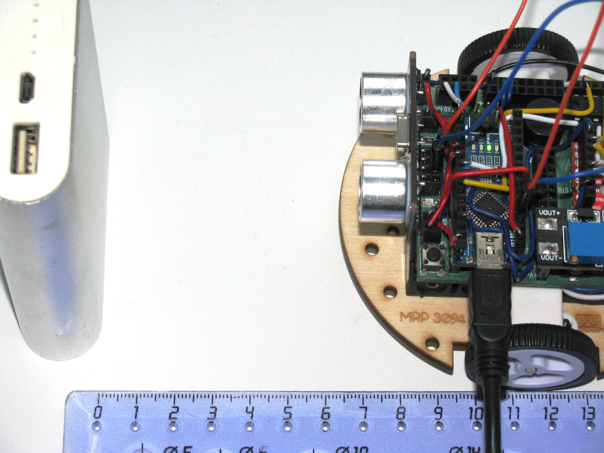

В данном уроке ты узнаешь что такое ультразвуковой дальномер, как он устроен и,
с его помощью, сможешь определять расстояния до объекта.<!--more-->

В нашем роботе
используется дальномер HC-SR04.
С этим устройством можно запрограммировать мобильного робота, чтобы он объезжал препятствия, или
рассчитывал расстояние до предметов, или двигался в сторону/от стены.

NOTE: Ультразвуковой дальномер - это устройство для бесконтактного
измерения расстояния

.Ультразвуковой дальномер HC-SR04
image::pictures/5.1.1.hcsr04.jpg[350, 350]

=== Принцип работы
Ультразвуковой дальномер посылает через передатчик импульсный сигнал определенной частоты (в нашем случае 40 кГц)
и слушает эхо через приемник. Отправленный сигнал встречается с объектом, отражается от него и попадает обратно в дальномер.
Дальномер измеряет время путешествия сигнала.

.Принцип работы УЗ дальномера
image::pictures/5.2.URFanimation.gif[350, 350]

По времени распространения звуковой волны можно оценить расстояние до объекта, используя формулу:

****
s = (t~и~ × с) / 2
****

* s - расстояние до объекта;
* t~и~ - время отправленного сигнала;
* с - скорость звука (343 м/с).

Почему мы наше выражение делим пополам? Все дело в том, что сигнал проходит 2 расстояния:

* От передатчика до препятствия;
* От препятствия до приемника.

Эти расстояния одинаковые (дальномер то у нас один).
Чтобы узнать точное расстояние до объекта необходимо общий путь следования сигнала поделить пополам.

TIP: Скорость звука равна 343 м/с или 1234,8 км/ч.

=== Характеристики УЗ дальномера HC-SR04

Данное устройство имеет 4 контактных ножки:
|===
| Vcc  | Питание (+)
| Trig | Цифровой вход
| Echo | Цифровой выход
| Gnd  | Земля (-)
|===

Подаем логическую единицу (высокий уровень напряжения) на цифровой вход *Trig*.
После завершения измерения, на цифровой выход *Echo* будет подана логическая единица на время, пропорциональное расстоянию до объекта.

|===
| Напряжение питания          | 5 В
| Потребляемый ток при работе | 15 мА
| Рабочая частота сигнала     | 40 кГц
| Рабочий диапазон            | 2 - 400 см
| Угол измерения              | 15°
| Габариты                    | 45х20х15 мм
|===

=== Ход работы
1. Установи контроллер и ультразвуковой дальномер на кросс-плату.
2. Подключи ультразвуковой дальномер к контроллеру по рисунку.
Поскольку "плюс" (*Vcc*) и "минус" (*Gnd*) уже разведены в дорожках кросс-платы, тебе остается
подключить 2 контакта: Цифровой выход *Echo* подключи к пину *A1* контроллера, а цифровой вход *Trig* - к пину *A0*.
+
.Схема подключения УЗ дальномера
image::pictures/5.3.URFinger.jpg[700, 700]
+
3. Подключи устройство к компьютеру через последовательный порт и загрузи на него код. Поскольку общение будет происходить через порт, важно не отсоединять провод от платы.
Данный код позволит контроллеру определять расстояние между дальномером и объектом:
+
....
// Ультразвуковой дальномер и расстояние до препятствия через последовательный порт

int echoPin = A1;                    // Назначаем пин A1. Сигнал с выхода дальномера
int trigPin = A0;                    // Назначаем пин A0. Сигнал с входа дальномера

void setup()
{
  // Определяем СОМ-порт
  // Задаем ему скорость 9600 бод
  Serial.begin(9600);
  pinMode(echoPin, INPUT);           // Задаем пин как вход
  pinMode(trigPin, OUTPUT);          // Задаем пин как выход
}

void loop()
{
  int t;                            // Время прохождения сигнала от приемника до передатчика
  int s;                            // Дальность до препятствия

  digitalWrite(trigPin, HIGH);       // Подаем сигнал на дальномер
  delayMicroseconds(10);             // Удерживаем 10 микросекунд
  digitalWrite(trigPin, LOW);        // Отмена подачи сигнала на дальномер
  t = pulseIn(echoPin, HIGH);        // Замеряем длину импульса
  s = t / 58;                        // Находим расстояние до препятствия по формуле s = c*t в см

  Serial.print(s);                  // Отправляем на компьютер значение
  Serial.println(" cm");             // Печатаем единицы измерения в см
  delay(100);
}
....
+
Данный программный код будет работать так:
С контроллера, через пин *A1* мы подаем сигнал длительностью 10 мкс на вход УЗ дальномера *Trig*.
С помощью встроенной функции *pulseIn()*, считываем продолжительность следования сигнала,
используя выход *Echo* УЗ дальномера, который подключен к пину *А0* контроллера.
После этого находим расстояние до препятствия с помощью формулы *s = t / 58*
и печатаем полученное значение и единицы измерения в монитор порта через последовательный порт.
+
****
Формула *s = t / 58* получилась из формулы *s = (t~и~ × с) / 2*
при переводе скорости звука из метров/секунду в сантиметры/микросекунду.

Скорость звука c = 343 м/с = 0,0343 см/мкс ≈ 1/29 см/мкс.

Получаем:

s = (t * c) / 2;

s = (t * (1/29)) / 2;

s = t * 1 / 58;

s = t / 58 - формула для нахождения расстояния до объекта в сантиметрах.
****
+
*Описание функций программного кода:*
+
* Про функции *setup()* и *loop()* ты знаешь из xref:Урок 1. Знакомство со светодиодом[урока 1];
* *Serial* -это встроенный объект, экземпляр класса. Предназначен для работы с последовательным портом, который содержит методы
*write*, *read*, *begin*, *println*, смотри xref:Урок 4. Передача информации с мобильного робота на компьютер через последовательный порт[урок 4];
* *digitalWrite()* - это функция, которая подает определенный уровень напряжения на цифровой пин. Либо LOW - низкий, либо HIGH - высокий.
(В нашем случае используются *аналоговые* пины *A1* и *A0*. Аналоговые пины могут выполнять роль цифровых пинов);
* *delayMicroseconds()* - Приостанавливает программу на время (в микросекундах), указанное в качестве параметра.
Для задержек, превышающих несколько тысяч микросекунд, используй *delay()*;
* *pulseIn(echoPin, HIGH)* - Считывает длительность сигнала на заданном порту (HIGH или LOW).
Например, если задано считывание HIGH функцией pulseIn(),
функция ожидает пока на заданном порту не появиться HIGH.
Когда HIGH получен, включается таймер, который будет остановлен когда на порту вход/выхода будет LOW.
Функция pulseIn() возвращает длину сигнала в микросекундах. Функция возвращает 0, если в течение заданного времени (таймаута) не был зафиксирован сигнал на порту.
Возможны некоторые погрешности в измерение длинных сигналов. Функция может измерять сигналы длиной от 10 микросекунд до 3 минут.
+
TIP: Аналоговый пин контроллера может играть роль цифрового.
+
WARNING: Цифровой пин контроллера *не* сможет заменить аналогового.
 +
4. Открой Arduino IDE и зайди в:
+
****
Сервис => Монитор порта
****
Контроллер через последовательный порт будет выдавать тебе расстояние до объекта в сантиметрах.
В моем случае расстояние до объекта равнялось 7 см.
+
.Монитор порта выдает расстояние до объекта
image::pictures/5.4.2.URFCOM.jpg[700, 700]
+
.Робот и возникшее перед ним препятствие

В этом уроке ты узнал, что такое ультразвуковой дальномер и как он работает.
Теперь ты можешь применить данное устройство в других задачах.

=== Задания
. Создай программу, которая будет включать светодиод при следующем условии:
если расстояние до объекта меньше 10 см, включить светодиод, иначе выключить.

. Реализуй парктроник с помощью дальномера и пищалки.
При приближении к препятствию пищалка должна пищать чаще, при отдалении - реже, а
при большом расстоянии - не подавать никаких сигналов. Не забудь подключить пищалку,
в этом тебе поможет Урок 3.
(Парктроник - это устройство, которое сигнализирует о приближении к препятствию.
Устанавливается на автомобили для удобства парковки).