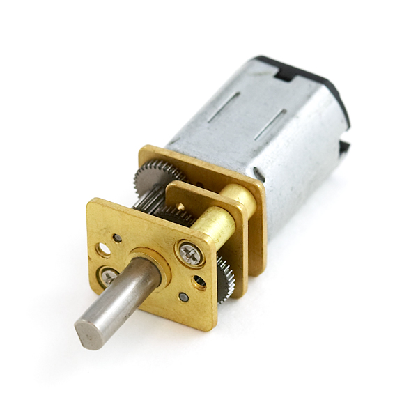

В этом уроке ты узнаешь как устроены моторы, которые используются в роботе,
Научишься их подключать и узнаешь как можно уменьшить количество занимаемых пинов контроллера, используя логические элементы.<!--more-->

Мотор с редуктором, который установлен на роботе представлен на фото.

.Коллекторный мотор мобильного робота

=== Ход работы
1. Установи на кросс-плату следующие элементы: контроллер, драйвер моторов,
логическую схему и схему питания (смотри рисунок ниже);
+
2. Соедини контроллер, драйвер моторов и логику проводами, как на рисунке.
+
3. Закрепи кросс-плату с помощью двух винтиков
+
.Схема подключения моторов
image::pictures/6.3.motorOn.jpg[700, 700]