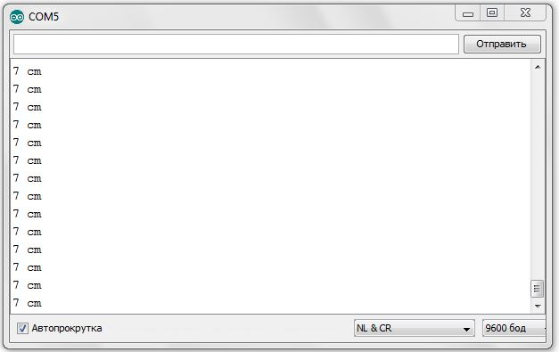

= Познаём робота вместе
:icons: font
:toc: left

== Подготовка
Текущие задания выполняются на мобильном роботе МРП309, но можно использовать и другие устройства семейства Arduino.

.Мобильный робот МРП309
image::pictures/mrp309.jpg[500, 500, align="center"]
.Прототипы мобильного робота
image::pictures/IMG_7309.JPG[500, 500, align="center"]

:arduinoide: https://www.arduino.cc/en/main/software#
Для программирования мобильного робота тебе понадобится среда разработки Arduino IDE, которую можно скачать здесь {arduinoide}

Запускаем Arduino IDE. Перед тобой открывается окно. В центре окна расположен *скетч* для написания кода (программы).

[WARNING]
Перед использованием Arduino IDE необходимо выполнить выбор порта загрузки, платы и микроконтроллера,
заходим в:

****
1.Инструменты => Плата. Выбираем Arduino Nano;

2.Инструменты => Процессор. Выбираем ATMega328;

3.Инструменты => Порт. Выбираем тот, которому соответствует наша подключенная плата, у меня это COM5.
****

Рассмотрим меню, которое расположено над скетчем.Когда ты напишешь свой код, необходимо убедится в том, что ты не сделал грубых ошибок. Эту проверку можно выполнить с помощью клавиши *Проверить*. Если проверка пройдет успешно, тогда можно смело загружать нашу программу на плату, при помощи клавиши *Загрузить*.

.Рабочее окно Arduino IDE
image::pictures/ArduinoIDE.png[500, 500]

== Урок 1. Знакомство со светодиодом
В данном уроке ты заставишь светодиод мигать.

TIP: Светодиод — это полупроводниковый прибор, трансформирующий электроток в видимое свечение.

.Внешний вид светодиода
image::pictures/1.1.jpg[300, 300]

У светодиода есть два контакта: отрицательный - *катод* и положительный - *анод*.

.Обозначение светодиода на схеме
image::pictures/1.2.1.luminodeode.jpg[300, 300]

WARNING: Чтобы светодиод не сгорел, он включается в схему через резистор. Резистор подключается к положительному (аноду) контакту светодиода.
Важно подобрать правильный номинал резистора.

.Схема включения светодиода через резистор

=== Расчет номинала резистора

Чтобы светодиод работал исправно, а не сгорел при первом подключении его к питанию,
 необходимо правильно подобрать номинал резистора. Резистор будет забирать излишнее напряжение.

Расчет номинала резистора выполняется по формуле, взятой из закона Ома.

R=(V~s~-V~l~)/I

* R - сопротивление резистора (измеряется в Омах (Ом));
* V~s~ - напряжение источника питания (измеряется в Вольтах (В));
* V~l~ - напряжение светодиода (В);
* I - ток светодиода (ток измеряется в Амперах (А)).

Рассмотрим пример:

Напряжение источника питания 5 В. Напряжение светодиода 2 В.
Максимальной электрический ток для светодиода 20 мА. (20 мА = 0,02 А).
Подставив данные значения в формулу, ты получишь сопротивление, необходимое для резистора:

R=(5-2)/0.02=150 Ом

Получается для того, чтобы светодиод не сгорел в данной цепи нужно выбрать номинал резистора с сопротивлением не менее 150 Ом. Лучше взять больше, про запас.
Возьмем например резистор, номиналом 220 Ом (номинал резисторов можно посмотреть в таблице номиналов).

Кстати,с помощью резистора можно регулировать яркость светодиода.
Чем больше сопротивление на резисторе, тем менее ярким будет светодиод.

=== Ход работы

1. Установи Arduino Nano на кросс-плату;
2. Подключи светодиод. На кросс-плате их два (синий и красный), находятся в передней части кросс-платы. Выбери любой. Плюс светодиода подсоедини к пину D13 платы Arduino Nano, Минус светодиода подсоедини к любому  минусу контактной колодки. Как правило, контакт «плюс» соединяют красным проводом, «минус» – черным.;
+
.Схема подключения светодиода к плате
image::pictures/1.2.3.luminodeode.jpg[700, 700]

3. Подключи устройство к компьютеру через последовательный порт и загрузи на него код:
+
....
//Код, позволяющий мигать светодиодом

void setup()
{
  pinMode(13, OUTPUT);         // Задаем пин 13 как выход
}

void loop()
{
  digitalWrite(13, HIGH);      // Включаем светодиод
  delay(1000);                 // Ждем одну секунду
  digitalWrite(13, LOW);       // Выключаем светодиод
  delay(1000);                 // Ждем одну секунду
}
....

Успех! Светодиод стал мигать с периодичностью в 1 секунду.
Изменяя значение внутри функции delay() (задержка), мы можем регулировать частоту миганий. В нашем случае установлено значение 1000 мс (миллисекунд), что соответствует 1 секунде.

Давай рассмотрим нашу программу подробнее.

TIP: В любом скетче Arduino IDE должны присутствовать две функции *setup()* и *loop()*, иначе при проверке кода вылезет ошибка.

* *setup()* - это функция с настройками микроконтроллера. Она выполняется единожды в начале программы при включении микроконтроллера.
В теле этой функции указываются параметры настройки, например выбор пина, который используется на плате.
* *loop()* - это функция выполнения. Она циклична, То есть все то, что находится в теле этой функции (внутри фигурных скобок {}) непрерывно повторяется. В этой функции описываются основные действия нашей программы.
* *void* - Это ключевое слово, определяемое тип данных, которое возвращает функция. *void* означает, что функция не возвращает никаких значений.

....
pinMode(13, OUTPUT);         // Задаем пин 13 как выход
....

* *pinMode()* - это процедура, которая устанавливает определенный пин в соответствующий режим;
* *13* - номер пина, к которому подключен светодиод;
* *OUTPUT* - режим, в который мы устанавливаем наш пин. В нашем случае пин определен как выход. Это значит что информационный сигнал будет передоваться из этого пина на светодиод.

....
digitalWrite(13, HIGH);      // Включаем светодиод
....

* *digitalWrite()* - это функция, которая подает определенный уровень напряжения на *цифровой* пин. Либо LOW - низкий, либо HIGH - высокий;
* *13* - номер пина, к которому подключен светодиод;
* *LOW* - низкий уровень напряжения, который соответствует значению, 0 Вольт;
* *HIGH* - высокий уровень напряжения, соответствует значению, 5 Вольт.

....
delay(1000);                 // Ждем одну секунду
....

* *delay()* - функция, останавливающая выполнение программы на заданное количество миллисекунд (1000 мс = 1 с).
* *// Включаем светодиод* - это комментарий к программе. После двух символов *//*
можешь писать все, что тебе захочется, сам микроконтроллер это никак не будет учитывать.
Обычно их пишут, чтобы помнить о том, какое действие выполняет данный кусок кода.
+
Молодец, а теперь попробуй выполнить задания.

=== Задания

1. Отредактируй программу таким образом, чтобы светодиод мигал с периодичностью в :

** 2 секунды;
** 5 секунд;
** 1/2 секунды.

2. Отредактируй программу так, чтобы светодиод горел постоянно.

3. Теперь сделай так, чтобы светодиод не горел (соответственно сама плата должна быть подключена к питанию).

4. Рассчитай сопротивление резистора, для цепи с напряжением питания, равным 9 В,
Напряжение светодиода 2 В, с максимально допустимым током 25 мА.

== Урок 2. Знакомство с кнопкой

В данном уроке ты научишься использовать кнопку для управления светодиодом.

TIP: Кнопка - это простой механизм, замыкающий цепь. Пока кнопка нажата - цепь замкнута, кнопка опущена - цепь разомкнута.

.Внешний вид тактовой кнопки
image::pictures/2.1.button.jpg[300, 300]

.Обозначение кнопки на схеме (слева с одной парой контактов, справа с двумя парами контактов)
image::pictures/2.2.1.button.jpg[350, 350]

Рассмотрим схему, представленную ниже:

.Схема подключения кнопки через стягивающий резистор
image::pictures/2.2.2.button.jpg[300, 300]

В этой схеме сигнал идет с источника питания через кнопку и попадает в плату Arduino Nano черезе пин D12,
в дальнейшем микроконтроллер обрабатывает этот сигнал и посылает сигнал на пин D13,
к которому подключен светодиод. Резистор в схеме играет роль *стягивающего*, который забирает излишки тока в землю.
На нашей кросс-плате к кнопке уже подключен данный резистор. Его номинал составляет 10 кОм.

Реализуем данную схему в ходе работы.

=== Стягивающий  резистор
Используются в схемах, рядом с контактами логических компонентов, где важно только 2 факта:
есть на контакте питание или нет. Например контакты Arduino.
Задача этих резисторов - не оставить контакт компонента в "подвешенном" состоянии.

Рассмотрим схему без стягивающего резистора

.Схема подключения светодиода через кнопку
image::pictures/2.2.3.buttonNotRezistor.jpg[300, 300]

Мы хотим, чтобы когда кнопка была не нажата, светодиод не горел (цифровой вход фиксировал отсутствие сигнала).
Но в данном случае наш вход то срабатывает, то не срабатывает в хаотическом состоянии (Светодиод может тускло гореть).
Причина этого — шумы. Которые возникают из различных воздействий окружающей среды. Провода действуют как антенны и производят электричество из электромагнитных волн среды.
Чтобы гарантировать отсутствие напряжения при разомкнутой цепи, рядом со светодиодом (либо любым другим цифровым входом платы) ставится стягивающий резистор:

.Схема подключения светодиода через кнопку с использованием стягивающего резистора
image::pictures/2.2.4.buttonRezistor.jpg[300, 300]

Теперь нам не будут мешать шумы. При нажатии на кнопку светодиод будет гореть, а при не нажатии гарантированно погаснет.

TIP: Как правило сопротивление стягивающего резистора не менее 10 кОм.

=== Оператор if...else
Конструкция *if...else* позволяет в программе выполнять проверку условия
и задавать варианты дальнейшего ее решения.

Синтаксис этой конструкции таков:
....
if (условие)       // Проверяется указанное условие
{
  // Действие A
}
else                           // Иначе
{
  // Действие B
....

Если *условие* будет верным, то программы перейдет к *Действию A*, а *Действие B* проигнорирует.

Если условие - *неверное*, то программа будет выполнять *Действие B*, а *Действие A* - игнорировать.

=== Ход работы

1. Установи Arduino Nano на кросс-плату;
2. Подключи кнопку и светодиод, как показано на рисунке.
+
.Схема подключения кнопки и светодиода к плате
image::pictures/2.3.buttonLuminodeode.jpg[700, 700]

3. Подключи устройство к компьютеру через последовательный порт и загрузи на него код:
+
....
// Код для включения светодиода с помощью кнопки

int buttonPin = 12;           // Назначаем пин с кнопкой
int ledPin = 13;              // Назначаем пин со светодиодом
boolean buttonState = LOW;    // Состояние кнопки отжата

void setup()
{
  pinMode(buttonPin, INPUT); // Задаем пин с кнопкой как вход,
  pinMode(ledPin, OUTPUT);   // а пин со светодиодом - как выход
}

void loop()
{
  // Считываем значение кнопки
  buttonState = digitalRead(buttonPin);
  if (buttonState == HIGH)       // Если кнопка нажата
  {
    digitalWrite(ledPin, HIGH);  // Включаем светодиод
  }
  else                           // Иначе
  {
    digitalWrite(ledPin, LOW);   // Выключаем светодиод
  }
}
....

4. Теперь нажми и удерживай кнопку. Если ты все делал по указаниям, то при нажатии на кнопку светодиод должен загораться, а при отпускании кнопки - гаснуть.

Когда ты нажимаешь на кнопку, ты замыкаешь цепь и электрический ток поступает на пин D12, в дальнейшем наша программа обрабатывает этот сигнал и подает высокий уровень напряжения на пин D13, к которому подключен светодиод.

Давай рассмотрим нашу программу подробнее.

Часть функций ты видел в xref:Урок 1. Знакомство со светодиодом[уроке 1]

....
int buttonPin = 12;           // Назначаем пин с кнопкой
....

Данной строчкой мы создаем глобальную переменную с именем *buttonPin*, типа *int* (integer - целый тип данных) и присваиваем ей значение *12*.
Имя переменной может быть любым, но понятным для тебя. Значение должно соответствовать пину, который ты выбрал, а тип переменной мы выбрали целый по причине того, что пины на плате обозначаются целыми числами (12, 13, 14 и тп.), а не дробными (0,5, 0,8 и тп.).

TIP: В программе каждая переменная имеет имя, тип данных и значение.

TIP: *Глобальные переменные* - это переменные, которые доступны всей программе, включая подпрограммы (пользовательские функции). *Локальные переменные* - переменные, определенные внутри подпрограммы (пользовательской функции). Они доступны только внутри функции, в которой они определены.

....
boolean buttonState = LOW;    // Состояние кнопки отжата
....

Переменная *buttonState* необходима нам для того, чтобы отследить состояние нашей кнопки. У нее может быть 2 состояния: нажата и отжата.
Поэтому мы создаем переменную типа *boolean* c начальным значением *LOW* (в ходе программы это значение будет изменяться).

* *boolean* - тип данных, принимающий всего два возможных значения (true (истина) или false (ложь); 1 или 0; LOW (низкий уровень напряжения) или HIGH (высокий уровень напряжения))

....
pinMode(buttonPin, INPUT); // Задаем пин с кнопкой как вход
....

* *pinMode()* - это процедура, которая устанавливает определенный пин в соответствующий режим;
* *buttonPin* - имя пина, к которому подключен светодиод. В xref:Урок 1. Знакомство со светодиодом[уроке 1] мы не задавали имя пину, а писали просто номер пина. Правильнее задавать имя для всех переменных;
* *INPUT* - режим, в который мы устанавливаем наш пин. В нашем случае пин определен как *вход*. Это значит что информационный сигнал будет передаваться из вне на этот пин;

....
buttonState = digitalRead(buttonPin);
....

С помощью функции *digitalRead()*, программа считывает значение с переменной *buttonPin* и присваивает его нашей переменной *buttonState*.

* *digitalRead()* - функция, считывающая значение с указанного пина. Возвращает либо LOW, либо HIGH;

....
if (buttonState == HIGH)       // Если кнопка нажата
{
  digitalWrite(ledPin, HIGH);  // Включаем светодиод
}
else                           // Иначе
{
  digitalWrite(ledPin, LOW);   // Выключаем светодиод
}
....

В данном месте программы мы проверяем состояние кнопки: нажата или нет. Используем при этом конструкцию *if, else*

Молодец, теперь ты знаешь как с помощью кнопки замыкать и размыкать электрическую цепь.
Вместо светодиода могут быть подсоединены и другие устройства, например пищалка (пьезоэлемент).

=== Задания
1. Поправь программу так, чтобы при опущенной кнопке светодиод горел, а при нажатой нет.

2. Поправь программу так, чтобы при опущенной кнопке светодиод горел, а при нажатой мигал с периодичностью в 1 секунду.
(Смотри xref:Урок 1. Знакомство со светодиодом[урок 1]).

3. Поправь программу так, чтобы при нажатии на кнопку светодиод мигал, а при
отпущенной кнопке нет.

4. Подсоедини в схему вместо светодиода пищалку (пьезоэлемент).
Что произошло?

== Урок 3. Знакомство с пищалкой (пьезоэлемент)

TIP: Пьезоэлемент - это

== Урок 4. Передача информации с мобильного робота на компьютер через последовательный порт
В ходе данной работы ты научишься передавать сигналы с компьютера на робота и
наоборот через проводной последовательный порт.

Это может потребоваться при управлении роботом с помощью клавиатуры, мыши или смартфона.

TIP: *Последовательный порт (COM-порт, Serial Port*)
 – это стандартный двунаправленный последовательный порт компьютера,
 используется для передачи данных согласно *протоколу RS-232* и не только.

TIP: *Протокол передачи данных* — стандарт, описывающий правила взаимодействия
функциональных блоков при передаче данных.

То есть протокол - набор правил, по которым будут общаться устройства.

NOTE: *RS-232 (Recommended Standard 232)* – это протокол
последовательной передачи данных между двумя устройствами
(информация передается пакетами по одному байту). Согласно данному протоколу,
информация передается у виде двоичного кода: логическому нулю соответствует
значение напряжение со знаком “+”, а логической единице соответствует
значение напряжения со знаком “–“.

=== Ход работы
1. Установи Arduino Nano на кросс-плату.
+
.Установка Nano в кросс-плату
image::pictures/4.1.comPrintln.jpg[700, 700]

2. Подключи устройство к компьютеру через последовательный порт и загрузи на него код.
Поскольку общение будет происходить через порт, важно *не отсоединять* провод от платы.
+
....
// Общение с компьютером через последовательный порт

void setup()
{
  // Определяем последовательный порт
  // Задаем скорость передачи данных 9600 бод
  Serial.begin(9600);

  // Отправляем по последовательному порту
  // сообщение "Hello"
  Serial.println("Hello");
}

void loop()
{
  // Проверка, пришла ли какая-нибудь
  // информация с компьютера
  if (Serial.available() > 0)
  {
    // Пришла. Считываем ее в переменную b
    byte b = Serial.read();
    // Отправлем ответную информацию на компьютер
    Serial.write(b);
  }
}
....
+
*Описание функций программного кода:*
+
* Про функции *setup()* и *loop()* ты знаешь из xref:Урок 1. Знакомство со светодиодом[урока 1];
* Оператор *if* тебе известен из xref:Урок 2. Знакомство с кнопкой[урока 2];
* *Serial* -это встроенный объект, экземпляр класса. Предназначен для работы с последовательным портом, который содержит методы
*write*, *read*, *begin*, *println* и др;
* *begin()* - это метод, который открывает порт для передачи данных. В этот метод передается скорость передачи, на которой будет происходить общение, в бодах (бит/секунду).
В нашем коде скорость передачи равна 9600 бод.
* *available()* -  метод, возвращающий целое число байт, которое микроконтроллер еще не прочитал;
Если это значение равно нулю, то это значит, что никаких данных через последовательный порт не приходило;
* *read()* - метод, который считывает пришедшую информацию с компьютера (пришедший байт);
* *print()* - метод, позволяющий печатать через последовательный порт текстовую информацию, переданную в качестве аргумента.
Также есть функция *println()*, которая добавляет после нашего текста символ переноса на новую строчку.
Таким образом каждая новая информация в мониторе порта будет располагаться с новой строчки (столбиком), а у метода *print()* вся информация будет располагаться в строчку.
* *write()* - метод, передает информационный байт в монитор порта. То есть  *print()* печатает строчку значения аргумента, а *write()* передает значение этого аргумента.
* *byte b* - переменная с именем b и типом данных *byte*. Byte - тип данных данных, содержащий 8-ми битное беззнаковое целое число, в диапазоне 0..255.
+
3. Открой Arduino IDE и зайди в:
+
****
Сервис => Монитор порта
****
Перед тобой откроется диалоговое окно для передачи символов через последовательный порт.
Робот будет приветствовать тебя фразой 'Hello', что в переводе с Английского значит 'Привет'.
+
.Монитор порта. Приветствие
image::pictures/4.2.1.monitorPort.jpg[700, 700]
+
4. Поставь курсор мыши в поле ввода, напиши любой текст и нажми *отправить*.
+
.Монитор порта. Ввод текста
image::pictures/4.2.2.monitorPort.jpg[700, 700]
+
.Монитор порта. Вывод введенного текста
image::pictures/4.2.3.monitorPort.jpg[700, 700]
+
После того, как ты нажал отправить, текст через последовательный порт
передался на контроллер, контроллер его обработал и отправил в монитор порта абсолютно такой же текст.
Таким вот простым образом можно производить передачу данных с компьютера на контроллер и наоборот.
+
5. Теперь создадим диалог между тобой и контроллером робота.
Смысл диалога состоит в том, что ты будешь писать роботу вопросы, а он будет тебе на них отвечать.
+
IMPORTANT: В данном задании важно задавать вопросы в точности также, как мы их опишем в программе, учитывая все знаки препинания
и заглавные буквы!
+
Вопросы можешь придумать свои, а можешь использовать те, что мы приготовили:
+
|===
|Ты:        | Привет!
|Контроллер:| Привет!
|Ты:        | Как тебя зовут?
|Контроллер:| Меня зовут Робас.
|Ты:        | Сколько тебе лет?
|Контроллер:| 3 года.
|Ты:        | Расскажи законы робототехники
|Контроллер:| Существует три основных закона робототехники. Их автор Айзек Азимов.

              1.Робот не может причинить вред человеку или своим бездействием допустить, чтобы человеку был причинён вред.

              2.Робот должен повиноваться всем приказам, которые дает человек, кроме тех случаев, когда эти приказы противоречат Первому Закону.

              3.Робот должен заботиться о своей безопасности в той мере, в которой это не противоречит Первому или Второму Законам.

|===
+
....
// Диалог через последовательный порт

void setup()
{
  // Определяем последовательный порт
  // Задаем скорость передачи данных 9600 бод
  Serial.begin(9600);
}

void loop()
{
  // Проверка, пришла ли какая-нибудь
  // информация с компьютера
  if (Serial.available() > 0)
  {
    // Пришла. Считываем ее в переменную b
    byte b = Serial.read();
    if (b == "Привет!")
    {
        Serial.println("Привет");
    }
    if (b == "Как тебя зовут?")
    {
        Serial.println("Меня зовут Робас");
    }
    if (b == "Сколько тебе лет?")
    {
        Serial.println("3 года");
    }
    if (b == "Расскажи законы робототехники")
    {
        Serial.println("Существует три основных закона робототехники. Их автор Айзек Азимов.");
        Serial.println("1.Робот не может причинить вред человеку или своим бездействием допустить, чтобы человеку был причинён вред.");
        Serial.println("2.Робот должен повиноваться всем приказам, которые даёт человек, кроме тех случаев, когда эти приказы противоречат Первому Закону.");
        Serial.println("3.Робот должен заботиться о своей безопасности в той мере, в которой это не противоречит Первому или Второму Законам.");
    }
  }
}
....
+
Теперь, с помощью монитор порта задавай вопросы роботу, а он тебе на них будет отвечать!
+
6. С помощью команд, посылаемых с компьютера через последовательный порт
можно управлять датчиками и сенсорами, подключенными к контроллеру. Попробуй
управлять светодиодом и пьезопищалкой, используя клавиатуру компьютера:
+
Собери схему, которая представлена на картинке:
+
.Схема подключения светодиодов-мигалок и пьезопищалки
image::pictures/4.3.onOff.jpg[700, 700]
+
В этой схеме мы подключаем к контроллеру 2 светодиода, из которых мы в последствии сделаем мигалку
Плюс синего светодиода подключаем к пину *D2* контроллера, плюс красного светодиода подключаем к пину *D3* контроллера,
Плюс пьезопищалки подключим к пину *D13*.
Минусы элементов подключим к дополнительной минусовой колодке.
+
Загрузи код:
+
....
// Управление через последовательный порт

int blueLed = 2;                   // Пин с синим светодиодом
int redLed = 3;                    // Пин с красным светодиодом
int piezo = 13;                    // Пин с пищалкой

void setup()
{
  // Определяем последовательный порт
  // Задаем скорость передачи данных 9600 бод
  Serial.begin(9600);
  Serial.println("Press comand..."); // Выводим фразу "Введите команду" при открытии монитор порта

  pinMode(blueLed, OUTPUT);        // Задаем пин как выход
  pinMode(redLed, OUTPUT);         // Задаем пин как выход
  pinMode(piezo, OUTPUT);          // Задаем пин как выход
}

void loop()
{
  // Проверка, пришла ли какая-нибудь
  // информация с компьютера
  if (Serial.available() > 0)
  {
    // Пришла. Считываем ее в переменную b
    char b = Serial.read();         // Если пришел символ 'r'
    if (b == 'r')
    {
        digitalWrite(redLed, HIGH); // Включаем красный светодиод
        Serial.println("Red on");   // Выводим текст в монитор порта. "Красный включен"
    }
     if (b == 'b')                  // Если пришел символ 'b'
    {
        digitalWrite(blueLed, HIGH);// Включаем синий светодиод
        Serial.println("Blue on");  // Выводим текст в монитор порта. "Синий включен"
    }
    if (b == 'p')                   // Если пришел символ 'p'
    {
        digitalWrite(piezo, HIGH);  // Включаем пищалку
        Serial.println("Piezo on"); // Выводим текст в монитор порта. "Пищалка включена"
    }
    if (b == '0')                   // Если пришел символ '0'
    {
        digitalWrite(blueLed, LOW); // Выключаем синий светодиод
        digitalWrite(redLed, LOW);  // Выключаем красный светодиод
        digitalWrite(piezo, LOW);   // Выключаем пищалку
        Serial.println("All off");  // Выводим текст в монитор порта: "Все выключено"
    }
  }
}
....
+
Программа работает так, что при нажатии на определенные символы на клавиатуре,
ты можешь управлять статусом светодиодов и пищалки. Таблица символов представлена ниже.
Можешь выбрать и свои символы, не забудь только поправить код.
+
|===
| Символ | Действие
| 'r'    | Red on - включение красного светодиода
| 'b'    | Blue on - включение синего светодиода
| 'p'    | Piezo on - включение пищалки
| '0'    | All off - выключить все
|===

Молодец, ты узнал что такое последовательный порт и научился, с его помощью, управлять контроллером.
А теперь попробуй выполнить задания.

=== Задания
1. Поменяй символы управления светодиодами и пищалкой по своему усмотрению.

2. Поправь последнюю программу так, чтобы при отправки одного символа с клавиатуры оба светодиода и пищалка
включались одновременно, а при другом символе все отключалось.

3. Поправь программу так, чтобы каждый светодиод и пищалка отключались
при нажатии на разные кнопки, а не одновременно.

== Урок 5. Ультразвуковой дальномер

В данном уроке ты узнаешь что такое ультразвуковой дальномер, как он устроен и,
с его помощью, сможешь определять расстояния до объекта. В нашем роботе
используется дальномер HC-SR04.
С этим устройством можно запрограммировать мобильного робота, чтобы он объезжал препятствия, или
рассчитывал расстояние до предметов, или двигался в сторону/от стены.

NOTE: Ультразвуковой дальномер - это устройство для бесконтактного
измерения расстояния

.Ультразвуковой дальномер HC-SR04

=== Принцип работы
Ультразвуковой дальномер посылает через передатчик импульсный сигнал определенной частоты (в нашем случае 40 кГц)
и слушает эхо через приемник. Отправленный сигнал встречается с объектом, отражается от него и попадает обратно в дальномер.
Дальномер измеряет время путешествия сигнала.

.Принцип работы УЗ дальномера
image::pictures/5.2.URFanimation.gif[350, 350]

По времени распространения звуковой волны можно оценить расстояние до объекта, используя формулу:

****
s = (t~и~ × с) / 2
****

* s - расстояние до объекта;
* t~и~ - время отправленного сигнала;
* с - скорость звука (343 м/с).

Почему мы наше выражение делим пополам? Все дело в том, что сигнал проходит 2 расстояния:

* От передатчика до препятствия;
* От препятствия до приемника.

Эти расстояния одинаковые (дальномер то у нас один).
Чтобы узнать точное расстояние до объекта необходимо общий путь следования сигнала поделить пополам.

TIP: Скорость звука равна 343 м/с или 1234,8 км/ч.

=== Характеристики УЗ дальномера HC-SR04

Данное устройство имеет 4 контактных ножки:
|===
| Vcc  | Питание (+)
| Trig | Цифровой вход
| Echo | Цифровой выход
| Gnd  | Земля (-)
|===

Подаем логическую единицу (высокий уровень напряжения) на цифровой вход *Trig*.
После завершения измерения, на цифровой выход *Echo* будет подана логическая единица на время, пропорциональное расстоянию до объекта.

|===
| Напряжение питания          | 5 В
| Потребляемый ток при работе | 15 мА
| Рабочая частота сигнала     | 40 кГц
| Рабочий диапазон            | 2 - 400 см
| Угол измерения              | 15°
| Габариты                    | 45х20х15 мм
|===

=== Ход работы
1. Установи контроллер и ультразвуковой дальномер на кросс-плату.
2. Подключи ультразвуковой дальномер к контроллеру по рисунку.
Поскольку "плюс" (*Vcc*) и "минус" (*Gnd*) уже разведены в дорожках кросс-платы, тебе остается
подключить 2 контакта: Цифровой выход *Echo* подключи к пину *A1* контроллера, а цифровой вход *Trig* - к пину *A0*.
+
.Схема подключения УЗ дальномера
image::pictures/5.3.URFinger.jpg[700, 700]
+
3. Подключи устройство к компьютеру через последовательный порт и загрузи на него код. Поскольку общение будет происходить через порт, важно не отсоединять провод от платы.
Данный код позволит контроллеру определять расстояние между дальномером и объектом:
+
....
// Ультразвуковой дальномер и расстояние до препятствия через последовательный порт

int echoPin = A1;                    // Назначаем пин A1. Сигнал с выхода дальномера
int trigPin = A0;                    // Назначаем пин A0. Сигнал с входа дальномера

void setup()
{
  // Определяем СОМ-порт
  // Задаем ему скорость 9600 бод
  Serial.begin(9600);
  pinMode(echoPin, INPUT);           // Задаем пин как вход
  pinMode(trigPin, OUTPUT);          // Задаем пин как выход
}

void loop()
{
  int t;                            // Время прохождения сигнала от приемника до передатчика
  int s;                            // Дальность до препятствия

  digitalWrite(trigPin, HIGH);       // Подаем сигнал на дальномер
  delayMicroseconds(10);             // Удерживаем 10 микросекунд
  digitalWrite(trigPin, LOW);        // Отмена подачи сигнала на дальномер
  t = pulseIn(echoPin, HIGH);        // Замеряем длину импульса
  s = t / 58;                        // Находим расстояние до препятствия по формуле s = c*t в см

  Serial.print(s);                  // Отправляем на компьютер значение
  Serial.println(" cm");             // Печатаем единицы измерения в см
  delay(100);
}
....
+
Данный программный код будет работать так:
С контроллера, через пин *A1* мы подаем сигнал длительностью 10 мкс на вход УЗ дальномера *Trig*.
С помощью встроенной функции *pulseIn()*, считываем продолжительность следования сигнала,
используя выход *Echo* УЗ дальномера, который подключен к пину *А0* контроллера.
После этого находим расстояние до препятствия с помощью формулы *s = t / 58*
и печатаем полученное значение и единицы измерения в монитор порта через последовательный порт.
+
****
Формула *s = t / 58* получилась из формулы *s = (t~и~ × с) / 2*
при переводе скорости звука из метров/секунду в сантиметры/микросекунду.

Скорость звука c = 343 м/с = 0,0343 см/мкс ≈ 1/29 см/мкс.

Получаем:

s = (t * c) / 2;

s = (t * (1/29)) / 2;

s = t * 1 / 58;

s = t / 58 - формула для нахождения расстояния до объекта в сантиметрах.
****
+
*Описание функций программного кода:*
+
* Про функции *setup()* и *loop()* ты знаешь из xref:Урок 1. Знакомство со светодиодом[урока 1];
* *Serial* -это встроенный объект, экземпляр класса. Предназначен для работы с последовательным портом, который содержит методы
*write*, *read*, *begin*, *println*, смотри xref:Урок 4. Передача информации с мобильного робота на компьютер через последовательный порт[урок 4];
* *digitalWrite()* - это функция, которая подает определенный уровень напряжения на цифровой пин. Либо LOW - низкий, либо HIGH - высокий.
(В нашем случае используются *аналоговые* пины *A1* и *A0*. Аналоговые пины могут выполнять роль цифровых пинов);
* *delayMicroseconds()* - Приостанавливает программу на время (в микросекундах), указанное в качестве параметра.
Для задержек, превышающих несколько тысяч микросекунд, используй *delay()*;
* *pulseIn(echoPin, HIGH)* - Считывает длительность сигнала на заданном порту (HIGH или LOW).
Например, если задано считывание HIGH функцией pulseIn(),
функция ожидает пока на заданном порту не появиться HIGH.
Когда HIGH получен, включается таймер, который будет остановлен когда на порту вход/выхода будет LOW.
Функция pulseIn() возвращает длину сигнала в микросекундах. Функция возвращает 0, если в течение заданного времени (таймаута) не был зафиксирован сигнал на порту.
Возможны некоторые погрешности в измерение длинных сигналов. Функция может измерять сигналы длиной от 10 микросекунд до 3 минут.
+
TIP: Аналоговый пин контроллера может играть роль цифрового.
+
WARNING: Цифровой пин контроллера *не* сможет заменить аналогового.
 +
4. Открой Arduino IDE и зайди в:
+
****
Сервис => Монитор порта
****
Контроллер через последовательный порт будет выдавать тебе расстояние до объекта в сантиметрах.
В моем случае расстояние до объекта равнялось 7 см.
+
.Монитор порта выдает расстояние до объекта

+
.Робот и возникшее перед ним препятствие
image::pictures/5.4.1.URFrobot.jpg[700, 700]

В этом уроке ты узнал, что такое ультразвуковой дальномер и как он работает.
Теперь ты можешь применить данное устройство в других задачах.

=== Задания
. Создай программу, которая будет включать светодиод при следующем условии:
если расстояние до объекта меньше 10 см, включить светодиод, иначе выключить.

. Реализуй парктроник с помощью дальномера и пищалки.
При приближении к препятствию пищалка должна пищать чаще, при отдалении - реже, а
при большом расстоянии - не подавать никаких сигналов. Не забудь подключить пищалку,
в этом тебе поможет Урок 3.
(Парктроник - это устройство, которое сигнализирует о приближении к препятствию.
Устанавливается на автомобили для удобства парковки).

== Урок 6. Моторы
В этом уроке ты узнаешь как устроены моторы, которые используются в роботе,
Научишься их подключать и узнаешь как можно уменьшить количество занимаемых пинов контроллера, используя логические элементы.

Мотор с редуктором, который установлен на роботе представлен на фото.

.Коллекторный мотор мобильного робота
image::pictures/6.1.motor.jpeg[350, 350]

=== Ход работы
1. Установи на кросс-плату следующие элементы: контроллер, драйвер моторов,
логическую схему и схему питания (смотри рисунок ниже);
+
2. Соедини контроллер, драйвер моторов и логику проводами, как на рисунке.
+
3. Закрепи кросс-плату с помощью двух винтиков
+
.Схема подключения моторов
image::pictures/6.3.motorOn.jpg[700, 700]
